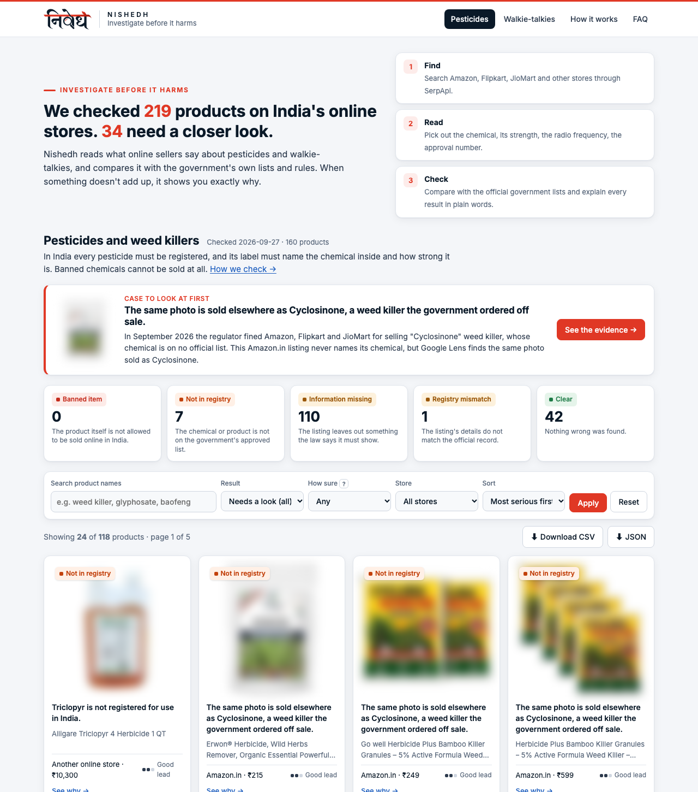
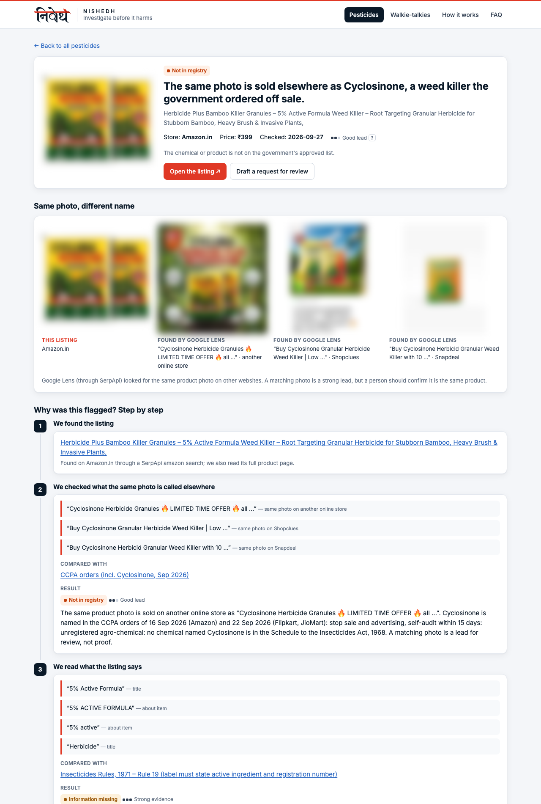
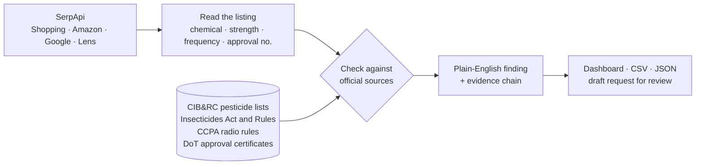

<div align="center">

<picture>
  <source media="(prefers-color-scheme: dark)" srcset="docs/logo-dark.png">
  
</picture>

### Is it legal to sell this online?

**Nishedh reads what India's online stores are selling, checks it against the government's own rulebooks, and shows a human reviewer exactly what doesn't add up.**

[](https://github.com/rudratoshs/nishedh/actions/workflows/ci.yml)


</div>

---

In September 2026, India's consumer regulator fined **Amazon and Flipkart ₹10 lakh each, and JioMart ₹5 lakh**, for selling *"Cyclosinone Herbicide"*, a weed killer whose chemical appears on no official list. Flipkart alone had sold **5.47 lakh units** since January 2024. Some were listed under *"Plant Seed"* and *"Bathing Bars & Soaps"*. The regulator ordered all three to audit their catalogues within 15 days, and called relying on sellers' own declarations **"gross negligence"** ([CCPA](https://ccpa.doca.gov.in/)).

Five days after the last of those orders, we pointed Nishedh at the same marketplaces.

> **With 31 searches, it found five Amazon.in weed killers that never say what chemical is inside, and whose product photo Google Lens finds for sale on other sites under the name "Cyclosinone".**

Nishedh is the audit the regulator asked for, run from the outside, by anyone, with every step shown.



## Try it in 30 seconds

No API key needed. The demo replays the exact search results from the 27 Sep 2026 run:

```bash
git clone https://github.com/rudratoshs/nishedh && cd nishedh
uv sync
uv run nishedh demo        # opens http://127.0.0.1:8787
```

Every number on this page comes from that snapshot, and [a test](tests/test_demo.py) fails if they ever stop matching.

## How a nameless weed killer was traced

The listing called itself *"Herbicide Plus Bamboo Killer Granules – 5% Active Formula"*. It named no chemical anywhere. Indian law (Rule 19, Insecticides Rules 1971) requires a pesticide label to say what it contains and how much.

1. **Find.** An Amazon search through SerpApi surfaced the listing. Nishedh then read its full product page: "5% active", no chemical.
2. **Look closer.** Nishedh sent the product photo to **Google Lens** through SerpApi. The same pack is sold on other sites as *"Cyclosinone Herbicide Granules"*, the exact product named in the regulator's orders.
3. **Explain.** The dashboard lays out the chain: the listing's own words, the matching photos side by side, the rule, and a link to the official source. A person can check each step in under a minute.



*Product photos are blurred in these screenshots; the dashboard shows them clearly and has a blur switch.*

## What it found in one afternoon

| | Checked | Flagged for review |
| --- | --- | --- |
| 🧪 **Pesticides** | 233 listings, 160 of them pesticides | **7** not on the official list (5 linked by photo to Cyclosinone), **1** claiming an "active" strength but naming no chemical, **11** more naming no chemical anywhere in the listing |
| 📻 **Radio equipment** | 156 listings, 59 of them radio equipment | **13** mobile signal boosters, which the 2025 rules say may not be listed at all ([PIB](https://www.pib.gov.in/PressReleasePage.aspx?PRID=2132575)); **2** walkie-talkies stating frequencies that need a government licence |

Total cost: **35 searches** from SerpApi's free plan.

Every result is a **lead for a person to check**, never a legal finding or an accusation against a seller. A matching photo is a strong lead, not proof, and Nishedh says so on every page.

## Why this matters

A farmer buying weed killer online can't check the government's pesticide register. The label is all they have, and when the label is blank or wrong, the risk lands on their crop, their soil and their health. The marketplaces host millions of listings written by the sellers themselves. The regulator has now said, in writing, that trusting those descriptions is not enough.

Nishedh turns the government's rulebooks into checks a computer can run over and over:

- **Regulators and consumer groups** get a ranked list of listings to review, each with its evidence.
- **Marketplaces** can run the same audit on their own catalogue before the regulator does.
- **Anyone** can ask "is this legal to sell?" and get an answer that cites its source.

## SerpApi is the eyes

Nishedh can't see a single listing without SerpApi. Flipkart and JioMart have no public product API, and Amazon.in blocks automated visitors. SerpApi turns all of them into clean, structured data, and each engine does a different job:

| SerpApi engine | Its job in Nishedh |
| --- | --- |
| **Google Shopping** (`gl=in`) | Casts the wide net: offers across Indian stores for each product type |
| **Amazon Search** + **Amazon Product** (`amazon.in`) | Titles first, then the full description, bullet points and specifications for anything suspicious |
| **Google Search** (`site:flipkart.com`, `site:jiomart.com`) | Reaches Flipkart and JioMart product pages |
| **Google Lens** | The detective: what is this same product photo called elsewhere? |



## Built to be trusted

A tool that accuses people has to be right. Nishedh is built so that it is careful, and so that you can check it.

- **Rules, not guesses.** Every verdict comes from written rules applied to the listing's own words. No AI model decides anything. The same input always gives the same answer.
- **Shows its working.** Each finding links the exact words, where they appeared, the official source, and the raw SerpApi response they came from.
- **Real government data.** The pesticide lists are parsed from the government's own PDFs, each pinned by its SHA-256 fingerprint. Those PDFs skip serial numbers, repeat others and misspell 56 chemical names; every case is handled and tested.
- **Precision first.** Three independent code reviews hunted for wrong flags. A copper water bottle, a cotton tunic, a football jersey, a mouthwash, Wi-Fi extenders, phone cases and a book are all pinned as "must not flag" tests.
- **Honest about certainty.** Every finding says how sure it is: *strong evidence*, *good lead*, or *weak signal* (only the search title was read).
- **Respects privacy.** Sellers and small shops are never named, only major marketplaces. The public demo data keeps only the fields Nishedh reads: no reviewer names, no contact details.
- **Cheap to run.** Every search result is cached and never paid for twice, and a monthly cap protects the free plan. The API key never touches disk, logs or error messages.
- **Tested.** 180 tests, `ruff`, `mypy --strict`, CI on every push.

## Run it live

```bash
echo "SERPAPI_API_KEY=your_key" > .env           # free plan: 250 searches a month
uv run nishedh sweep pesticides --live --max-live 40
uv run nishedh sweep radio --live --max-live 30
uv run nishedh serve                              # dashboard at http://127.0.0.1:8787
uv run nishedh report pesticides --format csv     # or json
uv run nishedh budget                             # searches used this month
```

Without `--live`, a sweep replays saved results and costs nothing.

<details>
<summary><b>How the checks work, in detail</b></summary>

1. **Sweep** a product category through SerpApi, merge duplicates, and fetch full product pages for listings not cleared by their title.
2. **Read** each listing: which chemicals it names (exact, fuzzy, trade-name and abbreviation matching against the official vocabulary), their strengths and formulation codes, and "5% active formula" claims that name no chemical. For radios: frequencies, approval (ETA) numbers and "licence-free" claims.
3. **Check** against the official source:
   - the CIB&RC lists (registered molecules and formulations; banned, refused, withdrawn and restricted pesticides) and the Schedule to the Insecticides Act, from the [government PDFs](https://ppqs.gov.in/divisions/cib-rc/registered-products);
   - the CCPA radio-equipment guidelines (2025), and the Department of Telecommunications' public approval certificates, which catch approval numbers borrowed from another product.
4. **Label check** with Google Lens for listings that name no chemical, plus a watchlist of products named in regulator orders.
5. **Review** in the dashboard. Findings export to CSV and JSON, and to a draft request for review addressed to the National Consumer Helpline.

Each finding carries one reason code (`banned_item`, `not_in_registry`, `information_missing`, `registry_mismatch` or `clear`) and a confidence level.

```
src/nishedh/
  search/client.py      SerpApi access: cache, budget, retries
  registry/             official pesticide lists, approval certificates, name normalisation
  extract/              what a listing says (pesticides, radio equipment)
  verdict/              rules and reason codes
  lens.py               Google Lens label check
  sweep.py, store.py    pipeline and evidence store
  web/                  review dashboard
```

</details>

## Honest limits

- Nishedh only sees what a listing shows. A label printed only on the pack photo needs the Lens check or a person.
- Flipkart and JioMart are reached through Google, so they appear less often than Amazon.in.
- The government lists are snapshots (dates in `data/registry/sources.json`). A newly registered product can look unregistered until the list is refreshed.
- Findings are leads for review, not legal decisions. Nothing here is an accusation against any seller.

## AI tools

Built with Claude Code (Anthropic) as a coding assistant for research, implementation, tests and independent code reviews.

## License

MIT
